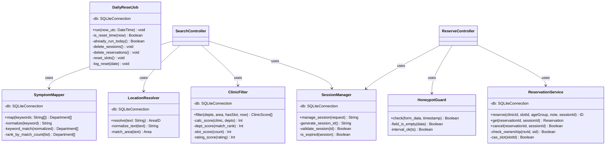

# クラス図

```mermaid
classDiagram
    class SessionManager {
        -db: SQLiteConnection
        +manage_session(request) String
        -generate_session_id() String
        -validate_session(id) Boolean
        -is_expired(session) Boolean
    }

    class SymptomMapper {
        -db: SQLiteConnection
        +map(keywords: String[]) Department[]
        -normalize(keyword) String
        -keyword_match(normalized) Department[]
        -rank_by_match_count(list) Department[]
    }

    class LocationResolver {
        -db: SQLiteConnection
        +resolve(text: String) AreaID
        -normalize_text(text) String
        -match_area(text) Area
    }

    class ClinicFilter {
        -db: SQLiteConnection
        +filter(depts, area, hasSlot, now) ClinicScore[]
        -calc_score(clinic, depts) Int
        -dept_score(match_rank) Int
        -slot_score(count) Int
        -rating_score(rating) Int
    }

    class ReservationService {
        -db: SQLiteConnection
        +reserve(clinicId, slotId, ageGroup, note, sessionId) ID
        +get(reservationId, sessionId) Reservation
        +cancel(reservationId, sessionId) Boolean
        -check_ownership(rsvId, sid) Boolean
        -cas_slot(slotId) Boolean
    }

    class DailyResetJob {
        -db: SQLiteConnection
        +run(now_utc: DateTime) void
        -is_reset_time(now) Boolean
        -already_run_today() Boolean
        -delete_sessions() void
        -delete_reservations() void
        -reset_slots() void
        -log_reset(date) void
    }

    class HoneypotGuard {
        +check(form_data, timestamp) Boolean
        -field_is_empty(data) Boolean
        -interval_ok(ts) Boolean
    }

    class SearchController {
    }
    class ReserveController {
    }

    SearchController --> SymptomMapper : uses
    SearchController --> LocationResolver : uses
    SearchController --> ClinicFilter : uses
    ReserveController --> HoneypotGuard : uses
    ReserveController --> ReservationService : uses
    SearchController --> SessionManager : uses
    ReserveController --> SessionManager : uses
```
