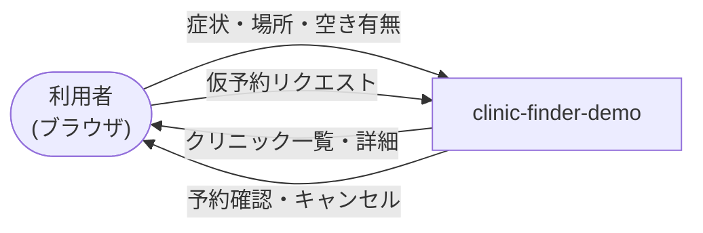
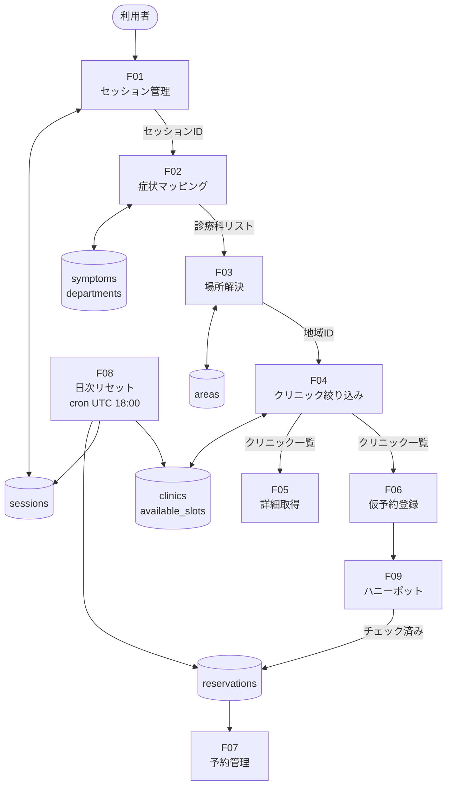

# DFD（データフロー図）

## Level 0: コンテキスト図

```mermaid
flowchart LR
    User(["利用者\n(ブラウザ)"])
    System["clinic-finder-demo"]

    User -- "症状・場所・空き有無" --> System
    System -- "クリニック一覧・詳細" --> User
    User -- "仮予約リクエスト" --> System
    System -- "予約確認・キャンセル" --> User
```

## Level 1: メインフロー

```mermaid
flowchart TD
    User(["利用者"])

    F01["F01\nセッション管理"]
    F02["F02\n症状マッピング"]
    F03["F03\n場所解決"]
    F04["F04\nクリニック絞り込み"]
    F05["F05\n詳細取得"]
    F06["F06\n仮予約登録"]
    F07["F07\n予約管理"]
    F08["F08\n日次リセット\ncron UTC 18:00"]
    F09["F09\nハニーポット"]

    DB_sessions[("sessions")]
    DB_symptoms[("symptoms\ndepartments")]
    DB_areas[("areas")]
    DB_clinics[("clinics\navailable_slots")]
    DB_reservations[("reservations")]

    User --> F01
    F01 <--> DB_sessions
    F01 -->|セッションID| F02
    F02 <--> DB_symptoms
    F02 -->|診療科リスト| F03
    F03 <--> DB_areas
    F03 -->|地域ID| F04
    F04 <--> DB_clinics
    F04 -->|クリニック一覧| F05
    F04 -->|クリニック一覧| F06
    F06 --> F09
    F09 -->|チェック済み| DB_reservations
    DB_reservations --> F07
    F08 --> DB_reservations
    F08 --> DB_sessions
    F08 --> DB_clinics
```
