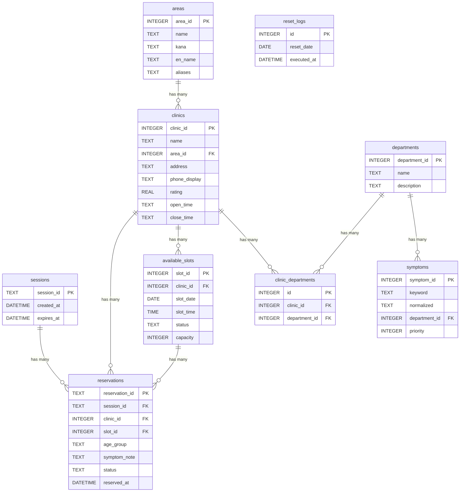

# ER 図

```mermaid
erDiagram
    sessions {
        TEXT session_id PK
        DATETIME created_at
        DATETIME expires_at
    }

    reservations {
        TEXT reservation_id PK
        TEXT session_id FK
        INTEGER clinic_id FK
        INTEGER slot_id FK
        TEXT age_group
        TEXT symptom_note
        TEXT status
        DATETIME reserved_at
    }

    clinics {
        INTEGER clinic_id PK
        TEXT name
        INTEGER area_id FK
        TEXT address
        TEXT phone_display
        REAL rating
        TEXT open_time
        TEXT close_time
    }

    available_slots {
        INTEGER slot_id PK
        INTEGER clinic_id FK
        DATE slot_date
        TIME slot_time
        TEXT status
        INTEGER capacity
    }

    clinic_departments {
        INTEGER id PK
        INTEGER clinic_id FK
        INTEGER department_id FK
    }

    departments {
        INTEGER department_id PK
        TEXT name
        TEXT description
    }

    areas {
        INTEGER area_id PK
        TEXT name
        TEXT kana
        TEXT en_name
        TEXT aliases
    }

    symptoms {
        INTEGER symptom_id PK
        TEXT keyword
        TEXT normalized
        INTEGER department_id FK
        INTEGER priority
    }

    reset_logs {
        INTEGER id PK
        DATE reset_date
        DATETIME executed_at
    }

    sessions ||--o{ reservations : "has many"
    clinics ||--o{ reservations : "has many"
    available_slots ||--o{ reservations : "has many"
    clinics ||--o{ available_slots : "has many"
    clinics ||--o{ clinic_departments : "has many"
    departments ||--o{ clinic_departments : "has many"
    areas ||--o{ clinics : "has many"
    departments ||--o{ symptoms : "has many"
```
