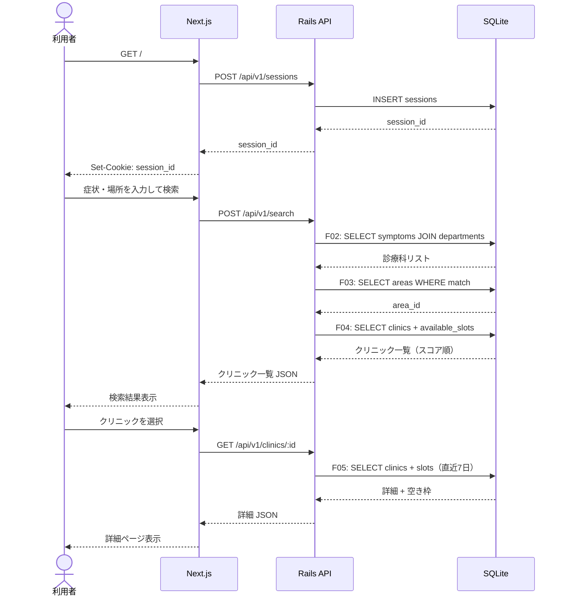
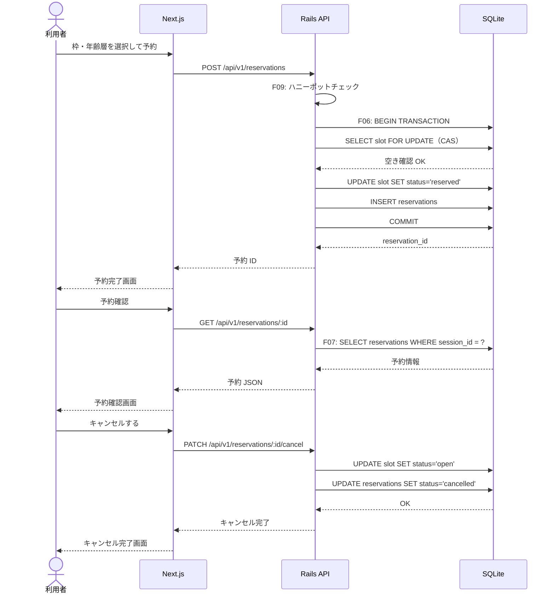
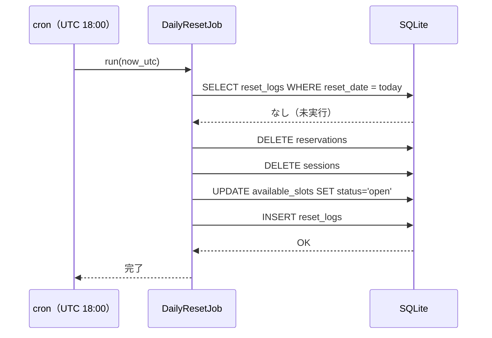

# シーケンス図

## 検索〜詳細表示

```mermaid
sequenceDiagram
    actor User as 利用者
    participant FE as Next.js
    participant BE as Rails API
    participant DB as SQLite

    User->>FE: GET /
    FE->>BE: POST /api/v1/sessions
    BE->>DB: INSERT sessions
    DB-->>BE: session_id
    BE-->>FE: session_id
    FE-->>User: Set-Cookie: session_id

    User->>FE: 症状・場所を入力して検索
    FE->>BE: POST /api/v1/search
    BE->>DB: F02: SELECT symptoms JOIN departments
    DB-->>BE: 診療科リスト
    BE->>DB: F03: SELECT areas WHERE match
    DB-->>BE: area_id
    BE->>DB: F04: SELECT clinics + available_slots
    DB-->>BE: クリニック一覧（スコア順）
    BE-->>FE: クリニック一覧 JSON
    FE-->>User: 検索結果表示

    User->>FE: クリニックを選択
    FE->>BE: GET /api/v1/clinics/:id
    BE->>DB: F05: SELECT clinics + slots（直近7日）
    DB-->>BE: 詳細 + 空き枠
    BE-->>FE: 詳細 JSON
    FE-->>User: 詳細ページ表示
```

## 予約フロー

```mermaid
sequenceDiagram
    actor User as 利用者
    participant FE as Next.js
    participant BE as Rails API
    participant DB as SQLite

    User->>FE: 枠・年齢層を選択して予約
    FE->>BE: POST /api/v1/reservations
    BE->>BE: F09: ハニーポットチェック
    BE->>DB: F06: BEGIN TRANSACTION
    BE->>DB: SELECT slot FOR UPDATE（CAS）
    DB-->>BE: 空き確認 OK
    BE->>DB: UPDATE slot SET status='reserved'
    BE->>DB: INSERT reservations
    BE->>DB: COMMIT
    DB-->>BE: reservation_id
    BE-->>FE: 予約 ID
    FE-->>User: 予約完了画面

    User->>FE: 予約確認
    FE->>BE: GET /api/v1/reservations/:id
    BE->>DB: F07: SELECT reservations WHERE session_id = ?
    DB-->>BE: 予約情報
    BE-->>FE: 予約 JSON
    FE-->>User: 予約確認画面

    User->>FE: キャンセルする
    FE->>BE: PATCH /api/v1/reservations/:id/cancel
    BE->>DB: UPDATE slot SET status='open'
    BE->>DB: UPDATE reservations SET status='cancelled'
    DB-->>BE: OK
    BE-->>FE: キャンセル完了
    FE-->>User: キャンセル完了画面
```

## 日次リセット（バックグラウンド）

```mermaid
sequenceDiagram
    participant Cron as cron（UTC 18:00）
    participant Job as DailyResetJob
    participant DB as SQLite

    Cron->>Job: run(now_utc)
    Job->>DB: SELECT reset_logs WHERE reset_date = today
    DB-->>Job: なし（未実行）
    Job->>DB: DELETE reservations
    Job->>DB: DELETE sessions
    Job->>DB: UPDATE available_slots SET status='open'
    Job->>DB: INSERT reset_logs
    DB-->>Job: OK
    Job-->>Cron: 完了
```
