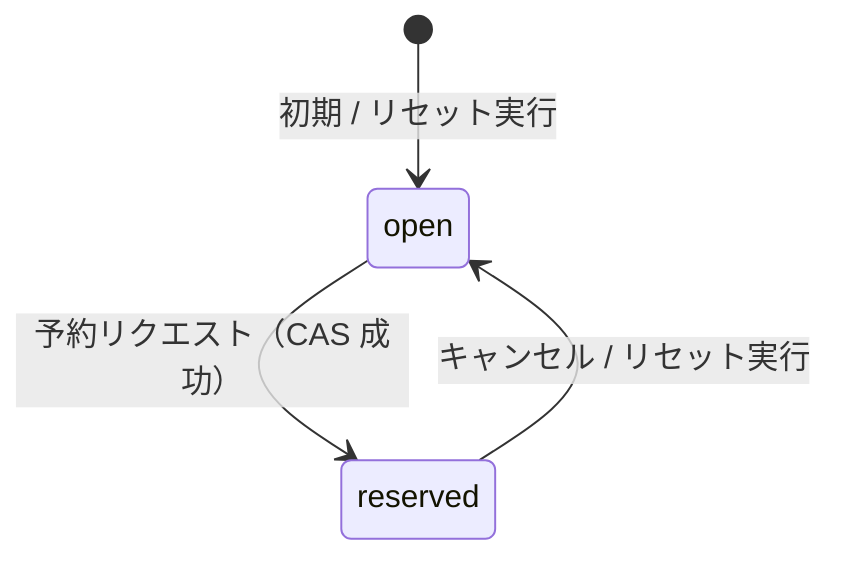
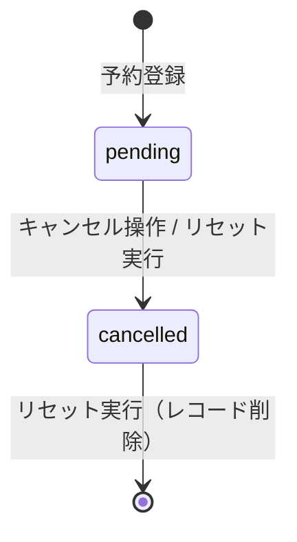
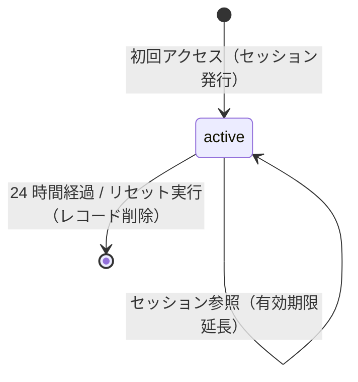

# 状態遷移図

## available_slots.status

```mermaid
stateDiagram-v2
    [*] --> open : 初期 / リセット実行
    open --> reserved : 予約リクエスト（CAS 成功）
    reserved --> open : キャンセル / リセット実行
```

## reservations.status

```mermaid
stateDiagram-v2
    [*] --> pending : 予約登録
    pending --> cancelled : キャンセル操作 / リセット実行
    cancelled --> [*] : リセット実行（レコード削除）
```

備考: デモ版では確定予約（confirmed）なし。仮予約（pending）のまま運用する。

## sessions の状態

```mermaid
stateDiagram-v2
    [*] --> active : 初回アクセス（セッション発行）
    active --> active : セッション参照（有効期限延長）
    active --> [*] : 24 時間経過 / リセット実行（レコード削除）
```
