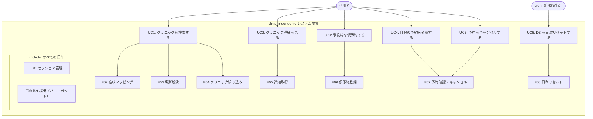

# ユースケース図

```mermaid
flowchart TD
    subgraph System["clinic-finder-demo システム境界"]
        subgraph include["include: すべての操作"]
            F01["F01 セッション管理"]
            F09["F09 Bot 検出（ハニーポット）"]
        end

        UC1["UC1: クリニックを検索する"]
        UC2["UC2: クリニック詳細を見る"]
        UC3["UC3: 予約枠を仮予約する"]
        UC4["UC4: 自分の予約を確認する"]
        UC5["UC5: 予約をキャンセルする"]
        UC6["UC6: DB を日次リセットする"]

        F02["F02 症状マッピング"]
        F03["F03 場所解決"]
        F04["F04 クリニック絞り込み"]
        F05["F05 詳細取得"]
        F06["F06 仮予約登録"]
        F07["F07 予約確認・キャンセル"]
        F08["F08 日次リセット"]

        UC1 --> F02
        UC1 --> F03
        UC1 --> F04
        UC2 --> F05
        UC3 --> F06
        UC4 --> F07
        UC5 --> F07
        UC6 --> F08
    end

    User(["利用者"])
    Cron(["cron（自動実行）"])

    User --> UC1
    User --> UC2
    User --> UC3
    User --> UC4
    User --> UC5
    Cron --> UC6
```

備考:
- 管理者 UI はデモ版では実装しない
- ユーザー認証はデモ版では実装しない（セッションのみ）
